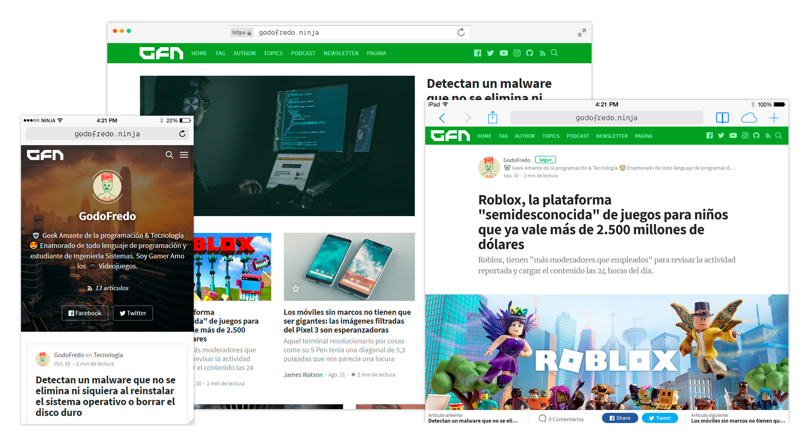

# Simply free theme for [Ghost](https://github.com/tryghost/ghost/)

[](https://github.com/TryGhost/Ghost)
[](https://www.paypal.me/godofredoninja)
[](https://www.buymeacoffee.com/GodoFredoNinja)

> *Simple and Elegant Theme.*

Hello :smile: , I created this theme for Ghost with inspiration from [Medium](https://medium.com/).
It is available for free so you can use on your site. If you have any suggestions to improve the theme,  you can send me a tweet [@GodoFredoNinja](https://goo.gl/y3aivK)

## If you have a :heart: and value my work. :pray: Please, help me with a small donation on [Paypal](https://www.paypal.me/godofredoninja) or [Here](https://www.paypal.com/cgi-bin/webscr?cmd=_s-xclick&hosted_button_id=Y7UB5Q8GVN3HN&source=url). It'll help motivate me to update the theme with many improvements

[](https://www.paypal.me/godofredoninja)

:arrow_right: If you still don't have a **Hosting for your Ghost**. Use [Digital Ocean](https://m.do.co/c/710a27a3b3de) using my [referral link]((https://m.do.co/c/710a27a3b3de)) and you will get free a **$50 credit** to use in [Digital Ocean]((https://m.do.co/c/710a27a3b3de)). This way you will also be helping me.

[](https://godofredo.ninja)

## Demo

You can see Simply in action on my Page [Demo](https://godofredo.ninja)

If for some reason I'm using a theme other than simply. then you can see the screenshots in [behance](http://bit.ly/simply-from-github-to-behance)

## Featured

- Support for different [languages](http://themes.ghost.org/docs/i18n#section-how-to-add-any-language) (en - es - de - tr - fr-CA - ru)
- Light Mode / Dark Mode
- [AMP](https://github.com/godofredoninja/Hodor-AMP-Ghost) Template
- Very fast search engine
- Related Articles (6 articles)
- Different templates for the Home Page
- Different templates for publishing posts
- Include Google Analytics Tracking use (Google Tag Manager)
- Page for (Contact - Podcast - Tags - Authors - Newsletter)
- Previous and next Post
- YouTube Subscribe Button in video post Format
- Social Media
- Instagram Feed in footer of Post
- Page 404 (Multiple faces emoticons)
- Pagination Infinite Scroll
- Support Disqus comments
- Buttons to share Post
- YouTube, Vimeo, kickstarter, dailymotion => Responsive
- Varied colors to change the look of the theme
- Lazy load Image for better performance only in backgrounds
- Code syntax [Prismjs](http://prismjs.com/index.html#languages-list) Supported all syntax.

## Web Browser Support for Simply

Simply supports the following web [browsers](http://caniuse.com/#search=flexbox).

### Font Icons

Icons generated by [Icomoon](https://icomoon.io/app/#/select) and import  `src/selection.json`

## Development

Simply uses [Gulp](https://gulpjs.com/) as a build tool and [Yarn](https://yarnpkg.com/) to manage front-end packages.

```bash
# clone this repo
$ git clone https://github.com/godofredoninja/simply.git

# Use branch Dev
$ git checkout dev

# install the dependencies
$ cd simply && yarn

# run build & livereload task
$ yarn dev

# link to ghost themes dir
$ ln -s $PWD path/to/ghost/content/themes/simply

# restart ghost server
$ cd path/to/ghost && ghost restart --development
```

### Build commands

- `yarn dev` — Compile assets when file changes are made, start [livereload](http://livereload.com/)
- `yarn build` — Compile and optimize the files in your assets directory
- `yarn release` — Compile assets for production and generate a `zip`

#### Additional commands

- `yarn lint:js` — [Standard](https://standardjs.com/), Check for errors in the script.
- `yarn lint:scss` — [Stylelint](https://stylelint.io/), Check for errors in the styles.
- `yarn lint` — check error in script and styles.
- `yarn scan` — [Ghost Scan](https://github.com/TryGhost/gscan) check for errors, deprecations and other compatibility issues.
- `yarn test` — Check the script errors and styles then check the theme if it is compatible with the latest version of Ghost.

## Documentation

To continue with the configuration [Read](https://github.com/GodoFredoNinja/simply)

### Credits

- [Hodor AMP](https://github.com/godofredoninja/Hodor-AMP-Ghost)
- [Normalize](https://necolas.github.io/normalize.css/)
- [Ghost Search](https://github.com/HauntedThemes/ghost-search)
- [Prismjs](http://prismjs.com/)
- [Medium Zoom](https://github.com/francoischalifour/medium-zoom)
- [Lazysizes](https://github.com/aFarkas/lazysizes)
- [Fonts](https://fonts.google.com/?query=domine&selection.family=Domine|Rubik)
- [Safari Light - Mockup](https://www.uplabs.com/posts/safari-light-version)
- [Safari Dark - Mockup](https://www.uplabs.com/posts/safari-dark-mode)

## Copyright & License

Copyright (c) 2017-2019 GodoFredo - Released under the [GPLv3 license](LICENSE)
