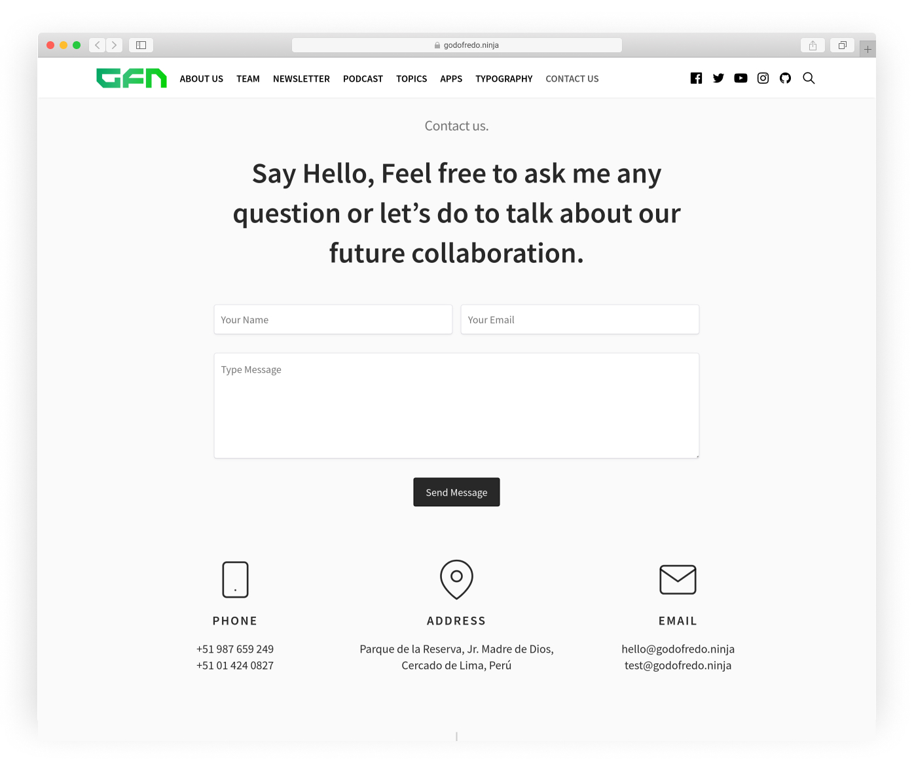

# Simply free theme for [Ghost](https://github.com/tryghost/ghost/)

[](https://github.com/TryGhost/Ghost)
[](https://www.paypal.me/godofredoninja)

> *Simple and Elegant Theme.*

Hello, I created this theme for Ghost with inspiration from [Medium](https://medium.com/).
It is available for free so you can use on your site. If you have any suggestions to improve the theme,  you can send me a tweet [@GodoFredoNinja](https://goo.gl/y3aivK)

## If you have a ❤ heart and value my work. 🙏 Please, help me with a small donation on [Paypal](https://www.paypal.me/godofredoninja) or [Here](https://www.paypal.com/cgi-bin/webscr?cmd=_s-xclick&hosted_button_id=Y7UB5Q8GVN3HN&source=url). It'll help motivate me to update the theme with many improvements


## Demo

You can see Simply in action on my Page [Demo](https://godofredo.ninja)

## Featured

- Support for different Languages
- [AMP](https://github.com/godofredoninja/Hodor-AMP-Ghost) Template
- Includes 4 templates for Home Page
- Responsive Layout
- Blog Navigation
- Include sections to add ads
- Include Google Analytics Tracking use (Google Tag Manager)
- Custom Search Engine (works almost in all languages)
- Template Page Newsletter (Mailchimp)
- Template Page Podcast
- Template Page Tag
- Template Page Authors
- Template page Contact
- Template Video Post Format
- Template Image post Format
- Template not Image
- Related Articles (6 articles)
- Previous and next button in the Post
- YouTube Subscribe Button in video post Format
- Links to Social Media
- 4 latest posts in the Sidebar
- Tags Cloud in the Sidebar
- Instagram random in (Post)
- Page 404 (Multiple faces emoticons)
- Pagination Infinite Scroll
- Support Disqus comments and Comment Count
- Buttons to share on social media
- YouTube, Vimeo, kickstarter, dailymotion => Responsive
- Varied colors to change the look of the theme
- Lazy load Image for better performance only in backgrounds
- Code syntax [Prismjs](http://prismjs.com/index.html#languages-list) Supported all syntax.

## Table of Contents

- [Web Browser Support for Simply](#web-browser-support-for-simply)
- [Ghost Settings](#ghost-settings)
- [Simply Settings](#simply-settings)
  - [Social Media](#1-social-media)
  - [YouTube Subscribe Button](#2-youtube-subscribe-button)
  - [Instagram](#3-instagram)
  - [Comments](#4-comments)
  - [Search](#5-search)
- [Theme Translation](#theme-translation)
- [AMP](#amp)
- [Home Page](#home-page)
- [Post Format](#post-format)
- [Tags Page](#tags-page)
- [Author Page](#author-page)
- [Contact Page](#contact-page)
- [Newsletter Page](#newsletter-page)
- [Podcast Page](#podcast-page)
- [Ads](#ads)
- [Change Theme Color](#change-theme-color)
- [Tracking Google Tag Mananger](#tracking-google-tag-mananger)
- [PrismJS code syntax](#prismjs-code-syntax)

## Web Browser Support for Simply

Simply supports the following web [browsers](http://caniuse.com/#search=flexbox).

## Ghost Settings

> Enable Subscribers checkbox on the labs page in your Ghost admin panel.


## Simply Settings

> You don't have to add all the Simply configurations. only the ones you need

### 1. Social Media

> Facebook and Twitter is not necessary because I use them from the ghost settings

Add the Social Links only for the services you want to appear in the header section of your website. Pay attention as enabling too many services will cause menu problems.

➡️ `Dashboard -> Code injection -> Site Footer`

```html
<script>
  var followSocialMedia = {
  'youtube': ['YOUR_URL','YOUR_TITLE'],
  'instagram': ['YOUR_URL','YOUR_TITLE'],
  'snapchat': ['YOUR_URL','YOUR_TITLE'],
  'dribbble': ['YOUR_URL','YOUR_TITLE'],
  'github': ['YOUR_URL','YOUR_TITLE'],
  'linkedin':['YOUR_URL','YOUR_TITLE'],
  'spotify':['YOUR_URL','YOUR_TITLE'],
  'codepen':['YOUR_URL','YOUR_TITLE'],
  'behance':['YOUR_URL','YOUR_TITLE'],
  'flickr':['YOUR_URL','YOUR_TITLE'],
  'pinterest':['YOUR_URL','YOUR_TITLE'],
  'telegram':['YOUR_URL','YOUR_TITLE'],
  'rss':['YOUR_URL','YOUR_TITLE'],
};
</script>
```

### 2. YouTube Subscribe Button

Subscription Button of YouTube in Video Post Format. Add the Channel Name and Channel ID which can be found here [YouTube Advanced Settings](https://www.youtube.com/account_advanced)

➡️ `Dashboard -> Code injection -> Site Footer`

```html
<script>
  var youTube = {
    name: 'YOUR_CHANNEL_NAME',
    channelId: 'YOUR_CHANNEL_ID'
  };
</script>
```

### 3. Instagram

> I get the last 10 images then show 6 randomly It will only be shown in the footer of the Post

First, you will need to get your account `userName` and `userId` and `accessToken` from the following URLs:

- userId: [codeofaninja.com/tools/find-instagram-user-id](https://codeofaninja.com/tools/find-instagram-user-id)
- accessToken: [instagram.pixelunion.net](http://instagram.pixelunion.net/)

➡️ `Dashboard -> Code injection -> Site Footer`

```html
<script>
  var instagramFeed  = {
    token: 'Token_app_instagram',
    userId: 'User_ID',
    userName: 'User_Name',
  };
</script>
```

### 4. Comments

Simply supports Disqus comments as well as comment counting

— First, you will need to get your account `disqusShortName`

➡️ `Dashboard -> Code injection -> Site Footer`

```html
<script>
var disqusShortName = 'YOUR_DISQUS_SHORTCUT_HERE';
</script>
```

### 5. Search

> The default search engine will only search the titles of the post

**Setup a Custom integration**

1. Go in your Ghost's `dashboard -> Integrations -> Add custom integration`
2. Set a name: `GodoFredo Themes Search`
3. Get the Content API Key and replace the demo key with this one
4. Get the admin domain. This will be different in some cases


➡️ `Dashboard -> Code injection -> Site Footer`

```html
<script>
  var searchSettings = {
    key: 'ADD_YOUR_API_KEY',
    url: 'https://demo.ghost.io',
  };
</script>
```

OR - Adding parameters to the search

```html
<script>
var searchSettings = {
  key: 'ADD_YOUR_API_KEY',
  url: 'https://demo.ghost.io',
  /* This is optional */
  options: {
    keys: [
      'title',
    ],
    limit: 10,
  },
  /* This is optional to perform filtering of the ghost api */
  api: {
    resource: 'posts',
    parameters: {
      limit: 'all',
      fields: ['title', 'slug'],
      filter: '',
      include: '',
      order: '',
      formats: '',
    },
  },
};
</script>
```

The search engine that includes Simply is very powerful, supports almost all languages and you can customize to your liking.

Read more about the search engine [Read More](https://github.com/HauntedThemes/ghost-search)

## Theme Translation

**Simply supports:**

- `en` — English default language
- `es` — Español
- `de` — German - By [dkbast](https://github.com/dkbast)
- `tr` — Turkish - By [Mertcan GÖKGÖZ](https://github.com/MertcanGokgoz)
- `fr-CA` — Canadian French - By [Pascal Andy](https://github.com/pascalandy)
- `ru` —  Russian - By [Partizan007](https://github.com/partizan007)


if you want to have in another language you just have to copy `locales>en.json` and rename the file then translate to your favorite language:

Just enter the [language/locale tag](https://www.w3schools.com/tags/ref_language_codes.asp) of the files to use (e.g.: `fr.json` for French, `zh.json` for Chinese, `ja.json` for Japanese)

## AMP

> Simply has a nice page for AMP

- Navigation
- links to followers in social media
- Tags
- Related Articles (6 articles)
- Buttons to share the article (Facebook - Twitter - Whatsapp)

To customize the AMP page [read here](https://github.com/godofredoninja/Hodor-AMP-Ghost)

## Home Page

> Simply - come with 4 Home page with different layout options

- First back up your routes in your ghost settings `Labs -> Routes -> Download current routes.yml`
- Re-download the Route and edit `routes.yml` line `collections -> template`
  - `index` — Masonry (Default)
  - `godo-template-sidebar` — Right Sidebar
  - `godo-template-grid` — Grid 3 Cols
- Once you have chosen save the file and upload again
- If do not observe changes restart ghost

- **Medium** - Rename the file `home-medium.hbs` to `home.hbs`

```yaml
collections:
  /:
    permalink: /{slug}/
    template:
      # - godo-template-grid
      # - godo-template-sidebar
      - index
```


## Post Format


**Post Image** — The Featured image will become large size

**Post Not Image** — The featured image will not be displayed in the article (Post)

**Post Video** — The first video in the article will be large size. Supports formats

- vimeo
- Dailymotion
- YouTube
- kickstarter

> Add video where convenient. When you change the theme you will not have problems and not have Problem in your AMP Template

## Tags Page

> A page will be displayed with all tags sorted from highest to lowest number of articles.

- Create a new page
- Choose your favorite url and title
- Select the `Archive Tags` template from the Template dropdown
- Publish the page
- To add the page to the navigation


## Author Page

- Create a new page
- Choose your favorite url and title
- Select the `Archive Author` template from the Template dropdown
- Publish the page
- To add the page to the navigation

## Contact Page

- Create a new page
- Choose your favorite url and title
- Select the `Archive Contact` template from the Template dropdown
- Publish the page
- To add the page to the navigation

➡️ Add your content and the contact form code using [FORMSPREE](https://formspree.io/) as a service. Please check the code example below.

```html
<form action="https://formspree.io/your@email.com" class="u-marginBottom40 u-marginAuto u-maxWidth740" method="POST">
  <div class="row">
    <div class="col s12 m6 u-marginBottom30">
      <input name="name" type="text" placeholder="Your Name" required>
    </div>
    <div class="col s12 m6 u-marginBottom30">
      <input name="email" type="email" placeholder="Your Email" required>
    </div>

    <div class="col s12 u-marginBottom30"><textarea name="message" placeholder="Type Message" required></textarea></div>
    <div class="col s12 u-textAlignCenter u-marginBottom40"><button type="submit" class="button button--large button--dark">Send Message</button></div>
  </div>
</form>
```

➡️ PHONE - ADDRESS - EMAIL

```html
<div class="pae row u-textAlignCenter">
    <div class="col s12 m6 l4 u-marginBottom30">
        <div class="pae-icon">
            <svg viewBox="0 0 24 24" width="64" height="64" stroke="currentColor" stroke-width="1" fill="none" stroke-linecap="round" stroke-linejoin="round"><rect x="5" y="2" width="14" height="20" rx="2" ry="2"></rect><line x1="12" y1="18" x2="12" y2="18"></line></svg>
        </div>
        <h4 class="pae-title">PHONE</h4>
        <div class="pae-des u-fontSizeBase">
            <p>+51 987 659 249</p>
            <p>+51 01 424 0827</p>
        </div>
    </div>

    <div class="col s12 m6 l4 u-marginBottom30">
        <div class="pae-icon">
            <svg viewBox="0 0 24 24" width="64" height="64" stroke="currentColor" stroke-width="1" fill="none" stroke-linecap="round" stroke-linejoin="round"><path d="M21 10c0 7-9 13-9 13s-9-6-9-13a9 9 0 0 1 18 0z"></path><circle cx="12" cy="10" r="3"></circle></svg>
        </div>
        <h4 class="pae-title">ADDRESS</h4>
        <div class="pae-des u-fontSizeBase">
            <p>Parque de la Reserva, Jr. Madre de Dios, Cercado de Lima, Perú</p>
        </div>
    </div>

    <div class="col s12 m6 l4 u-marginBottom30">
        <div class="pae-icon">
            <svg viewBox="0 0 24 24" width="64" height="64" stroke="currentColor" stroke-width="1" fill="none" stroke-linecap="round" stroke-linejoin="round"><path d="M4 4h16c1.1 0 2 .9 2 2v12c0 1.1-.9 2-2 2H4c-1.1 0-2-.9-2-2V6c0-1.1.9-2 2-2z"></path><polyline points="22,6 12,13 2,6"></polyline></svg>
        </div>
        <h4 class="pae-title">EMAIL</h4>
        <div class="pae-des u-fontSizeBase">
            <p>hello@godofredo.ninja</p>
            <p>test@godofredo.ninja</p>
        </div>
    </div>
</div>
```

➡️ Google Maps

```html
<div class="archive-contact-maps u-marginBottom40 u-textAlignCenter">
    <div class="video-responsive">
      ADD_YOUR_IFRAME_GOOGLE_MAPS
    </div>
</div>
```



## Newsletter Page

- Create a new page
- Choose your favorite url and title
- Select the `Archive Newsletter` template from the Template dropdown
- Write the list as normal in your content
- To have the **Mailchimp** form copy the code and add an `HTML` section in Ghost then change the form action url.

Example: `<form action="https://ninja.us10.list-manage.com/subscribe/post?u=5c52d5a541f6ab2e8d6020e82&id=f5f6d462c4">`

```html
<!-- <godo-nesletter> Mailchimp -->
<div class="godo-ne">
  <!-- Replace => Action -->
  <form id="godo-form" class="godo-ne-form" action="YOUR_URL_OF_LIST_Mailchimp" method="post" target="_blank">
      <label for="fieldEmail">Email Address</label>
      <div class="godo-ne-form-group">
        <input id="fieldEmail" class="godo-ne-input" name="EMAIL" type="email" placeholder="yourname@example.com" required="">
        <button class="godo-ne-button button" type="submit">Subscribe</button>
      </div>
      <small>No marketing campaigns. No jibber jabber. Unsubscribe anytime.</small>
  </form>
</div>
```

- **Testimonies** Copy the code and paste into an `HTML` section in Ghost

```html
<div class="godo-n-q">

  <div class="godo-n-q-i">
    
    <h3>Tim Cook</h3>
    <div class="godo-n-q-d">CEO, Apple</div>
    <blockquote>"This is a pretty fantastic newsletter tbh, I definitely recommend it"</blockquote>
  </div>

  <div class="godo-n-q-i u-hide-before-md">
    
    <h3>Satya Nadella</h3>
    <div class="godo-n-q-d">CEO, Microsoft</div>
    <blockquote>"Finally, this newsletter is something we can really agree on"</blockquote>
  </div>

  <div class="godo-n-q-i u-hide-before-md">
    
    <h3>John O'Nolan</h3>
    <div class="godo-n-q-d">CEO, Ghost</div>
    <blockquote>"I should really get around to organising some quotes one of these days"</blockquote>
  </div>

</div>
```

- Publish the page
- To add the page to the navigation


## Podcast Page

- Create a new page
- Choose your favorite title
- Use the url `podcast`
- In your articles use the internal tags `#podcast`
- First back up your routes in your ghost settings `Labs -> Routes -> Download current routes.yml`
- Re-download the Route and edit `routes.yml` line `routes`

```yaml
routes:
  /podcast/:
    controller: channel
    filter: tag:[hash-podcast]
    data:
      post: page.podcast
    limit: 10
    template: godo-podcast
```

- In an `HTML` block in your ghost editor add this code for your content.

```html
<p class="spc-h-e">The Podcast</p>

<p class="spc-des">Updates and behind the scenes stories about the world of Ghost. Hosted by Ghost founders <em>John O'Nolan</em> &amp; <em>Hannah Wolfe</em>.</p>

<div class="spc-buttons">

    <a href="https://itunes.apple.com/">
    
    <span>iTunes</span>
  </a>

  <a href="https://www.pocketcasts.com/">
    
    <span>Pocket Casts</span>
  </a>

  <a href="https://anchor.fm/">
    
    <span>RSS</span>
  </a>

</div>
```


## Ads

Simply has sections to add your ads.

You have to enter the following directory `partials/ad` and add in each file your ad blocks.

```bash
./partials/ad
├── ad-article-footer.hbs
├── ad-article-header.hbs
├── ad-article-medium.hbs
├── ad-author-top.hbs
├── ad-home-footer.hbs
├── ad-home-medium.hbs
├── ad-home-top.hbs
├── ad-loop-footer.hbs
├── ad-loop-medium.hbs
├── ad-podcast-footer.hbs
├── ad-podcast-medium.hbs
├── ad-podcast-top.hbs
├── ad-sidebar.hbs
└── ad-tag-top.hbs
```

— It is important to add the following style in your ghost settings. in the section `Code injection -> Blog Header`

```html
<style>.godo-ad-article-top,.godo-ad-author-top,.godo-ad-home-top,.godo-ad-podcast-top,.godo-ad-tag-top{margin-top:30px}.godo-ad-article-medium,.godo-ad-footer,.godo-ad-home-medium,.godo-ad-medium,.godo-ad-podcast-footer,.godo-ad-podcast-medium,.godo-ad-home-top,.godo-ad-home-footer,.godo-ad-article-footer {margin-bottom:30px}</style>
```

## Change Theme Color

> It is very easy to customize with your favorite colors.


To change the color of the Simply theme select one of the theme styles below and copy it into the:

➡️ `Setting -> Code Injection -> Blog Header`

```html
<link href="/assets/styles/theme/deep-orange.css" rel="stylesheet">
<link href="/assets/styles/theme/cyan.css" rel="stylesheet">
<link href="/assets/styles/theme/blue-dark.css" rel="stylesheet">
<link href="/assets/styles/theme/red.css" rel="stylesheet">
<link href="/assets/styles/theme/blue-semi-dark.css" rel="stylesheet">
<link href="/assets/styles/theme/dark.css" rel="stylesheet">
<link href="/assets/styles/theme/lavender.css" rel="stylesheet">
<link href="/assets/styles/theme/green.css" rel="stylesheet">
<link href="/assets/styles/theme/pink.css" rel="stylesheet">
```

## Tracking Google Tag Mananger

Simply keeps track of the user's actions on the page, for example:

- Header
  - Click Logo
  - Click Menu Name
  - Click Social Media
  - Click Search
- Sidebar
  - Click Sidebar post
  - Click Name of the sidebar Tag Cloud
- Article
  - Click Author Name
  - Click Author Avatar
  - Click Author Facebook
  - Click Author Twitter
  - Click Share
  - Click Next Post
  - Click Prev Post
  - Click Related Post
  - Click Name of Tag
  - Click Comments Button

### Settings Google Tag Mananger

With [Google Tag Manager](https://tagmanager.google.com), there are a million different ways to make your tagging setup leaner and more flexible.

> I'll use an easy way to reduce redundancy here. It's the generic event tag 😊 you guessed it!

— What are you waiting? 🖐 hands in action.

#### First we'll create triggers

1. Click Triggers
2. New
3. Name of the Trigger
4. Select Custom Event
5. Name of the Event

— If you do not understand. look at the image


#### Second we'll create Tag

1. Click tags
2. New
3. Name of the Tag
4. Select Google Analytics
5. Track Type `Event`
6. `{{Event Category}}`
7. `{{Event Action}}`
8. `{{Event Label}}`
9. `{{Event Value}}`
10. Non-Interaction Hit `true`
11. Here you have to add your Google Analytics code. I have my Google Analytics code in a Global variable. I select my global variable
12. Triggering — Select the trigger we created first

— If you do not understand. look at the image


#### Third Insert code

🤔 *You can improve the code. I'll leave that to your imagination.*

➡️ Copy the below script to `Settings -> Code Injection -> Blog Footer`

```html
<script>
/* Tracking With Google Tag Mananger */
var godoTracking = document.querySelectorAll('.godo-tracking');
godoTracking.forEach(function(item) {
  item.addEventListener('click', function() {
    var godoCategory = this.getAttribute('data-event-category');
    var godoAction = this.getAttribute('data-event-action');
    var godoLabel = this.getAttribute('data-event-label');
    var godoValue = this.getAttribute('data-event-non-interaction');

    dataLayer.push({
      'event' : 'godoGhostEvent',
      'eventCategory' : godoCategory,
      'eventAction' : godoAction,
      'eventLabel' : godoLabel,
      'eventValue' : godoValue,
    });
  });
});
</script>
```

### PrismJS code syntax

Make your code stand out with the PrismJS code highlighter.
PrismJS allows you to select which languge you embeded and performs code highlighting according to the language. Neat!

Take a look at the [Prismjs Supported Language List](http://prismjs.com/#languages-list)


### Credits

- [Hodor AMP](https://github.com/godofredoninja/Hodor-AMP-Ghost)
- [Normalize](https://necolas.github.io/normalize.css/)
- [Ghost Search](https://github.com/HauntedThemes/ghost-search)
- [Prismjs](http://prismjs.com/)
- [Medium Zoom](https://github.com/francoischalifour/medium-zoom)
- [Lazysizes](https://github.com/aFarkas/lazysizes)
- [Fonts](https://fonts.google.com/?query=pt&selection.family=PT+Serif|Source+Sans+Pro)
- [Safari Light - Mockup](https://www.uplabs.com/posts/safari-light-version)

## Copyright & License

Copyright (c) 2019 GodoFredoNinja - Released under the [GPLv3](LICENSE).
