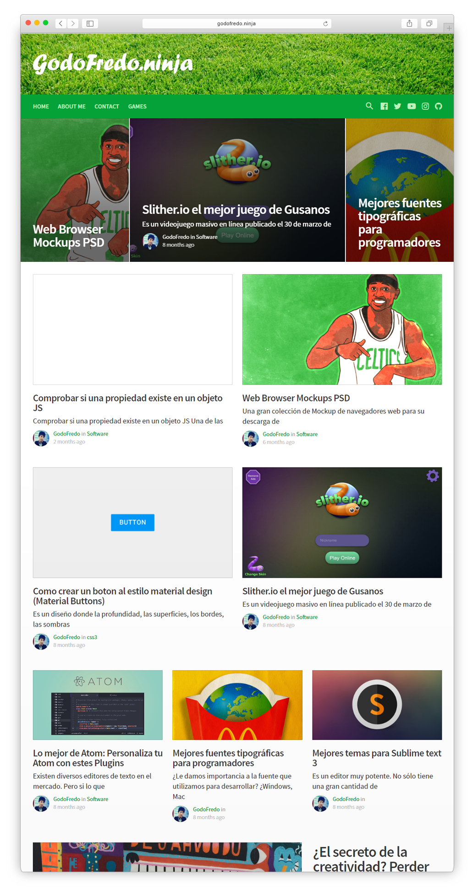
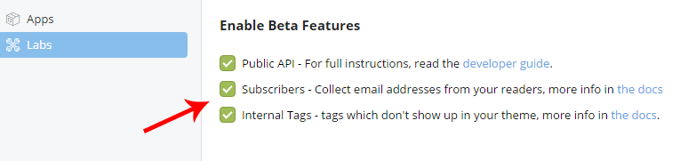
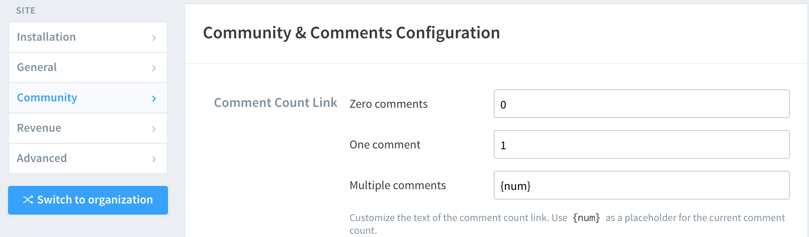
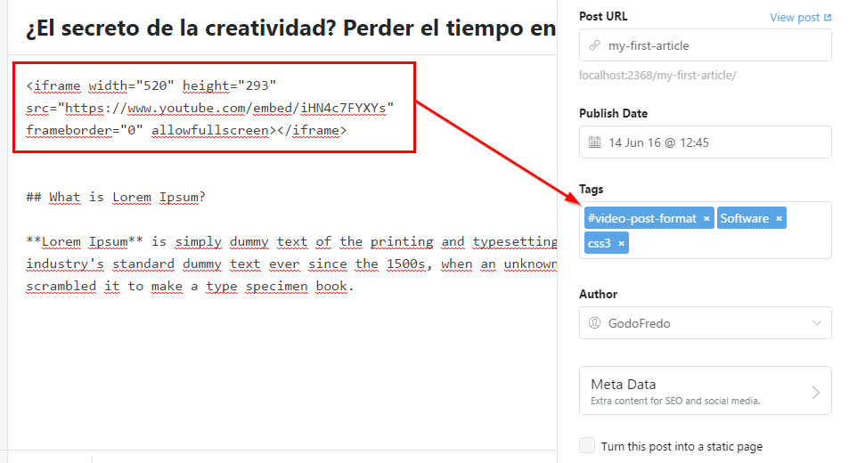
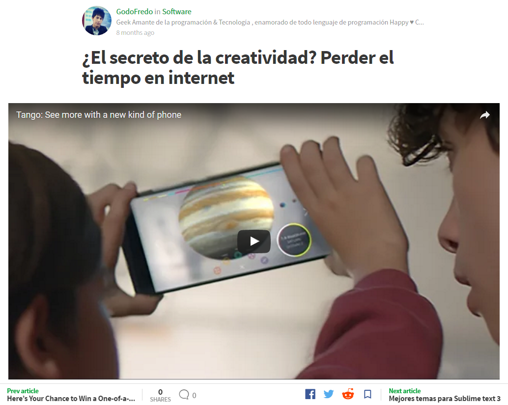

# Simply theme for [Ghost v1](https://github.com/tryghost/ghost/) by @GodoFredoNinja

[](https://github.com/TryGhost/Ghost)
[](https://nodejs.org/en/)
[](https://bit.ly/PayPal-GodoFredoNinja)

> Simple and Elegant theme for [Ghost](https://github.com/tryghost/ghost/).

### ⚠ This theme is only compatible with ghost version 1.x.x. — If you want to use in previous versions follow the link 👉 [Simply-Tag-0.02](https://github.com/godofredoninja/simply/tree/0.0.2)

### Free theme for Ghost

Hello, I created this theme for Ghost with inspiration from [Medium](https://medium.com/).
It is available for free so you can use on your site. It is strictly forbidden to use it for commercial use. If you have any suggestions to improve the theme,  you can send me a tweet [@GodoFredoNinja](https://goo.gl/y3aivK)

## ❤ Please, help me with a small donation on [Paypal](https://bit.ly/PayPal-GodoFredoNinja). It'll help motivate me to update the theme with many improvements.
[](https://bit.ly/PayPal-GodoFredoNinja)




## Demo
You can see Simply in action on my Page [Demo](https://goo.gl/V7moIY)

## Featured
- Responsive layout
- Blog navigation
- Page 404 (Multiple faces emoticons)
- Page subscribe
- Pagination Infinite Scroll
- Cover images for blog, tag and author
- links to followers in social media
- Related Articles (3 articles)
- Video Post Format => add tag `#video-post-format`
- Image post Format => add tag `#image-post-format`
- 5 articles latest posts in the (author - tag) section sidebar
- Previous and next button in the Post
- Has button to save the link on Facebook
- Has a search engine system
- Support for comments (Facebook or Disqus)
- Support for counter comments (Facebook or Disqus)
- Buttons to share the article (Facebook - Twitter - Reddit - Linkedin - Pinterest - Whatsapp)
- Counter shared articles on Facebook
- Additional sticky content in the sidebar
- YouTube, Vimeo, kickstarter => Video Responsive
- Lazy image loading for better performance only in backgrounds
- Code syntax [Prismjs](http://prismjs.com/index.html#languages-list) Supported all syntax.

> **To have the best design is recommended to have 12 or 14 articles per page.**

## Web Browser Support for Simply
Simply supports the following web [browsers](http://caniuse.com/#search=flexbox).

# Simply settings

> Enable all checkboxes on the labs page in your Ghost admin panel.



## Social Links
Add the Social Links only for the services you want to appear in the header section of your website. Pay careful attention as enabling too many services will cause menu problems.

Add the following code in `Settings -> Code Injection -> Blog Footer`

```html
<script>
/* links to followers in social media */
var followSocialMedia = {
  'youtube': 'https://...',
  'instagram': 'https://...',
  'snapchat': 'https://...',
  'dribbble': 'https://...',
  'github': 'https://...',
  'linkedin':'https://...',
  'spotify':'https://...',
  'codepen':'https://...',
  'behance':'https://...',
  'flickr':'https://...',
  'pinterest':'https://...',
  'rss':'https://...',
};
</script>
```

## Save To Facebook
The Save button lets people save articles in your [Facebook](https://developers.facebook.com/docs/plugins/save?locale=en_US) account.

For it to work please add the following code in `Settings -> Code Injection -> Blog Footer.`
```html
  <div id="fb-root"></div>
  <script>(function(d, s, id) {
    var js, fjs = d.getElementsByTagName(s)[0];
    if (d.getElementById(id)) return;
    js = d.createElement(s); js.id = id;
    js.async=true;
    js.src = "//connect.facebook.net/en_US/sdk.js#xfbml=1&version=v2.8";
    fjs.parentNode.insertBefore(js, fjs);
  }(document, 'script', 'facebook-jssdk'));</script>
```


## Enable Disqus or Facebook Comments
Only enable either Disqus or Facebook comments.

#### Disqus Comments
Insert your [Disqus shortname](https://shortname.disqus.com/admin/) in both the comments and Disqus comment count sections.

1. To enable Disqus comments update the code in `Settings -> Code Injection -> Blog Header.`
  ```html
  <style>
    .simply-facebook {display:none !important}
  </style>
  ```

2. To enable Disqus comments update the code in Settings -> Code Injection -> Blog Footer.
  ```html
  <script>
    /* Disqus for Comments */
    var disqusShortName = 'YOUR_DISQUS_SHORTCUT_HERE';
  </script>

  <!-- Disqus Comments Count-->
  <script id="dsq-count-scr" src="//YOUR_DISQUS_SHORTCUT_HERE.disqus.com/count.js" async></script>
  ```

To ensure the Disqus comment count is working correctly verify that the Disqus settings -> Comment & Community Configuration is set as seen below.


#### Facebook Comments
To use Facebook comments, skip the configuration Disqus.

This enables comments and comment counter.

1. Add the code in `Settings -> Code Injection -> Blog Header`

  ```html
  <style>
    .simply-disqus {display:none !important}
  </style>
```
2. Add the code `Settings -> Code Injection -> Blog Footer`
> If you have the Facebook button to save. It is no longer necessary to add the following code.

  ```html
    <div id="fb-root"></div>
    <script>(function(d, s, id) {
      var js, fjs = d.getElementsByTagName(s)[0];
      if (d.getElementById(id)) return;
      js = d.createElement(s); js.id = id;
      js.async=true;
      js.src = "//connect.facebook.net/en_US/sdk.js#xfbml=1&version=v2.8";
      fjs.parentNode.insertBefore(js, fjs);
    }(document, 'script', 'facebook-jssdk'));</script>
  ```

## Add additional content to the sidebar
Add you own custom content into the side bar by editing the `./partials/sidebar.hbs` file.

```html
<div class="sidebar-items u-marginBottom30">
    <h3 class="sidebar-title u-fontSizeBase u-textColorDarker">.. your title ..</h3>
    <p class="u-textColorDarker u-fontSize15 u-marginBottom10">.. your description or content ..</p>
</div>

<!-- Add sticky content to the bottom -->
<div class="sidebar-sticky">

    <div class="sidebar-items u-marginBottom30"> <!--Open Book -->
        <h3 class="sidebar-title u-fontSizeBase u-textColorDarker">.. your title sticky ..</h3>
        <p class="u-textColorDarker u-fontSize15 u-marginBottom10"> .. your Content sticky .. </p>
    </div> <!-- close Book -->

</div>
```

## Warning - Note - Success
Add some more styling options to your articles text with these three styles.


### PrismJS code syntax
Make your code stand out with the PrismJS code highlighter.
PrismJS allows you to select which languge you embeded and performs code highlighting according to the language. Neat!

Take a look at the [Prismjs Supported Language List](http://prismjs.com/#languages-list)


## Video Post Format
If you want to have a video post format, you only have to add the tag `#video-post-format`. The first video in the article will be large in size.


---

---

## Image Post Format
If you want to have a image post format, you only have to add the tag `#image-post-format` The Featured image will become large in size.


## Change Theme Style
To make your changes with your favorite colors you just have to add the following code and replace with your colors
[Themes](THEMES.md).

### Credits
- [Normalize](https://necolas.github.io/normalize.css/)
- [Jquery.ghostHunter](https://github.com/jamalneufeld/ghostHunter)
- [Prismjs](http://prismjs.com/)
- [sticky-kit](https://github.com/leafo/sticky-kit)
- [lunr.js](https://github.com/olivernn/lunr.js)
- [zoom.js](https://github.com/fat/zoom.js/)
- [jquery-lazyload](http://www.appelsiini.net/projects/lazyload)
- [Fonts](https://fonts.google.com/?selection.family=Droid+Serif:400,700|Source+Code+Pro|Source+Sans+Pro:300,400,600,700&query=Droid+Serif)

## Copyright & License

Copyright (c) 2017 GodoFredoNinja - Released under the [GPL 3 license](LICENSE).
